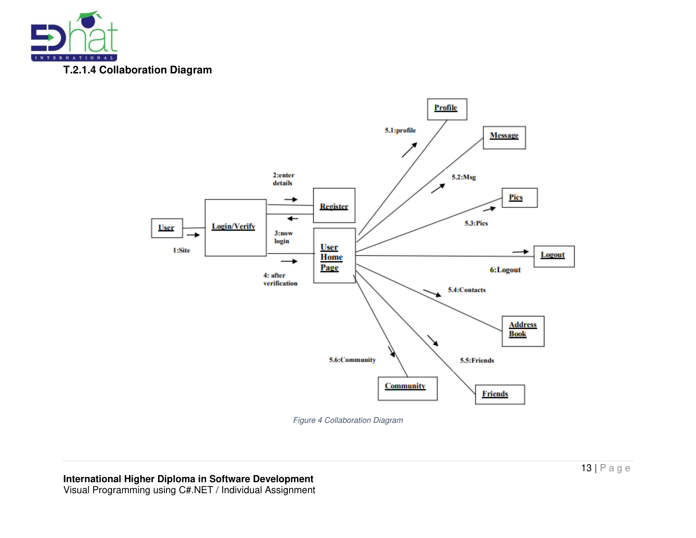

# Visual Programming using C# — Project README

> This README is adapted from the provided assignment report and showcases the core artifacts — diagrams, UI screenshots, testing notes, and the Gantt chart — in a GitHub-friendly format.

## Overview

This repository documents a **Visual Programming using C#/.NET** assignment. It includes:
- A short overview of the .NET platform
- System analysis & design artifacts (UML, ERD, DFD, wireframes)
- Implementation UI screenshots
- Testing notes and conclusions
- Project timeline (Gantt)

## .NET at a Glance

- **Implementations:** .NET (cross‑platform), .NET Framework (Windows), Xamarin/Mono (mobile)
- **Key components:** **CLR** (execution engine) and **Class Library** (types & APIs)
- **Benefits:** unified type system, managed memory, language interoperability, simpler deployment

> For full context, see the original report PDF in this repository.

---

## System Analysis & Design

### Use Case Diagram

### Class Diagram

### Sequence Diagram

### Collaboration Diagram

### ER Diagram

### DFD (Level 02)

### Wireframe

---

## Implementation (C#/.NET Forms)

Below are representative UI screenshots from the implemented system.

---

## Testing Summary

The project followed a standard multi‑level testing approach:

- **Unit Testing:** Verified module logic and boundaries (white‑box focus).
- **Integration Testing:** Exercised interfaces between modules to ensure correct collaboration.
- **System Testing:** Validated end‑to‑end behavior against the specified requirements.

---

## Project Timeline

### Gantt Chart

---

## References

- Microsoft Docs — .NET Overview  
- Atlassian — Testing Types & Practices  
- Figma — Wireframing resources  
- Research on Global Software Development trends

> See the original PDF for the complete reference details.

---

## How to Use

- Place this `README.md` at the root of your GitHub repository.
- Keep the `assets/` folder alongside it for images to render on GitHub.
- Optionally add your C# solution (e.g., `*.sln`, `*.csproj`, `Form*.cs`) and any exported diagrams as source files.

---

## Acknowledgments

Thanks to the supervising lecturer, peers, and everyone who contributed feedback during the assignment process.
